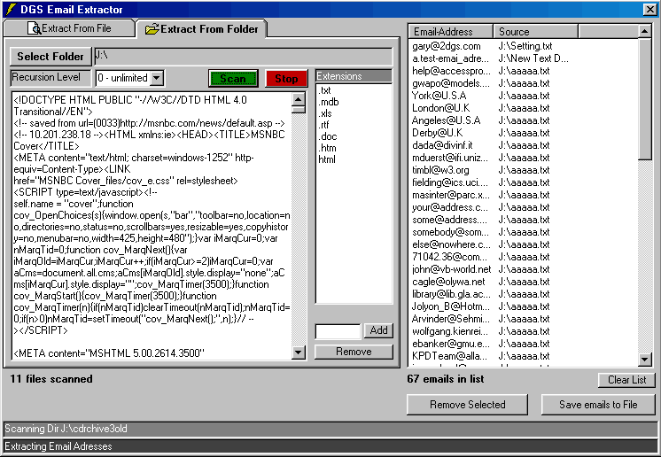

## File Email Extractor

### Description

Extracts valid email addresses (quickly) from local .txt,.rtf,.doc,.mdb,.xls files and more.

Will scan entire drive recursively. Save list in different formats.

Uses single regular expression and recursive dir scanner class.

Please vote!

If you do not like this program return it, and keep the recursive directory scanner as my gift to you.
 
### More Info
 
Requires Microsoft scripting runtime

Requires Microsoft VBscript Regular Expresions 5.5

             |
---                |---
**Submitted On**   |2002-04-09 03:14:08
**By**             |[RegX](https://github.com/Planet-Source-Code/PSCIndex/blob/master/ByAuthor/regx.md)
**Level**          |Intermediate
**User Rating**    |4.8 (95 globes from 20 users)
**Compatibility**  |VB 6\.0
**Category**       |[Complete Applications](https://github.com/Planet-Source-Code/PSCIndex/blob/master/ByCategory/complete-applications__1-27.md)
**World**          |[Visual Basic](https://github.com/Planet-Source-Code/PSCIndex/blob/master/ByWorld/visual-basic.md)
**Archive File**   |[File\_Email713394122002\.zip](https://github.com/Planet-Source-Code/regx-file-email-extractor__1-33626/archive/master.zip)

